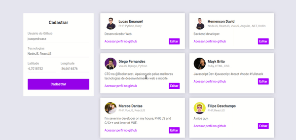

<h1 align="center"> 🚀 Semana OmniStack 10 - DevRadar 📌</h1>

<p align="center">
  <a aria-label="Versão do Node" href="https://github.com/nodejs/node/blob/master/doc/changelogs/CHANGELOG_V12.md#12.14.1">
    </img>
  </a>
  <a aria-label="Versão do React" href="https://github.com/facebook/react/blob/master/CHANGELOG.md#16120-november-14-2019">
    </img>
  </a>
  <a aria-label="Versão do Expo" href="https://www.npmjs.com/package/expo-cli/v/3.11.5">
    </img>
  </a>
</p>

<p align="center">
  <a href="#-visão-geral">Visão geral</a> |
  <a href="#-tecnologias">Tecnologias</a> |
  <a href="#-projeto">Projeto</a> |
  <a href="#-instalação">Instalação</a> 
</p>

<br>

## 🌎 Visão Geral:
O DevRadar é um projeto com que tem o intuito de conectar desenvolvedores com base nas tecnologias usadas e na proximidade entre os mesmos.

<br>

## 💻 Tecnologias:  
O DevRadar foi desenvolvido com as seguintes tecnologias:
- [NodeJS](https://nodejs.org/pt-br/)
- [ReactJS](https://reactjs.org)
- [React Native](https://facebook.github.io/react-native/)
- [Expo](https://expo.io/)

<br>

## 📚 Projeto:

### 💻 Frontend:

Frontend em ReactJS, com o desafio de editar e excluir Devs concluído. ✅



### 📱 Mobile:

Mobile utilizando React Native com a abstração Expo. Com o desafio do input e teclado concluído. ✅


<br>

### 🌐 Instalação:

#### Backend:

Primeiramente prepare o banco de dados, podendo possível utilizar o [MongoDB Atlas](https://www.mongodb.com/cloud/atlas) ou o [Docker](https://www.docker.com/get-started) com a imagem **MONGO** na porta **27017**.

Depois mude a *string* do arquivo `backend/src/index.js` na função `mongoose.connection()`.

Para instalar todas as depêndencias, dentro do diretório `backend` rode o comando:

```bash
yarn
```

Para rodar o servidor NodeJS, dentro do diretório `backend`, rode o comando:

```bash
yarn server
```

#### Frontend:

Para instalar todas as depêndencias, dentro do diretório `frontend` rode o comando:

```bash
yarn
```

Para rodar a aplicação ReactJS, dentro do diretório `frontend`, rode o comando:

```bash
yarn start
```

A aplicação já abrirá altomaticamente em seu navegador.

#### Mobile:

Para instalar todas as depêndencias, dentro do diretório `mobile`, rode o comando:

```bash
yarn
```

Para rodar a aplicação React Native, já tendo o [Expo](https://expo.io/) instado, rode o comando:

```bash
yarn start
```

ou

```bash
expo start
```